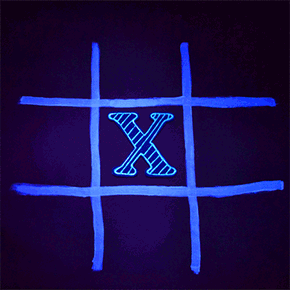

# TicTacToe

### What is [Tic-tac-toe](https://en.wikipedia.org/wiki/Tic-tac-toe) ?
Tic-tac-toe or noughts and crosses or Xs and Os is a paper-and-pencil game for two players, X and O, who take turns marking the spaces in a 3×3 grid. The player who succeeds in placing three of their marks in a horizontal, vertical, or diagonal row wins the game.

The following example game is won by the first player, X:

### Requirements:
* Two player's should be able to play the game, both sitting at the same computer.
* The board should be printed out every time a player makes a move.
* We should be able to accept input of the player position and then place a symbol on the board.

### What needs to happen ?
1. We need to print a board.
2. Take in player input.
3. Place their input on the board.
4. Check if the game is won,tied, lost, or ongoing.
5. Repeat 3 and 4 until the game has been won or tied.
6. Ask if players want to play again.
